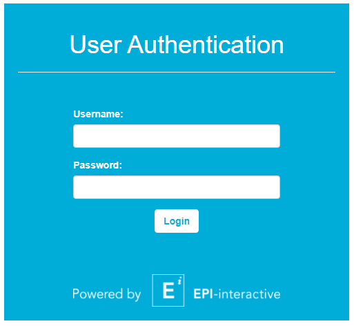

# User Authentication
A sample implementation of a login page for an R Shiny app. It uses the bcrypt R package which provides bindings to the 'blowfish' password hashing algorithm. We've used a similar method with database backend and also implemented a user and permission system on top of it. You can log into the demo app using admin / admin.

You can try out the app [here](https://shiny.epi-interactive.com/user_authentication)



## How it works
In this snippet we have a preconfigured username and hashed password that gets compared with the submitted username and password using the `bcrypt` package in R. 

``` r
  # The expected username and password are admin/admin
  # The long password string in the following variable is generated by hashpw("admin")
  credentials <- reactiveValues(userIsAuth = FALSE, username = "admin",
                                password = "$2a$12$jxoOXWVRB0XPJzfyViVjY.NkgqZlCcW4UbnOjRPvppH0ENRlH8s3y")

```
Listen for a click on the login button and compare the result using `checkpw()`
``` r
observeEvent(input$loginbtn, {
    if(input$username == credentials$username)
    {
      credentials$userIsAuth <<- checkpw(input$password, credentials$password)
    }
    else
    {
      showModal(modalDialog(
        title = "Error",
        "Incorrect username or password. please try again! (Hint: admin/admin)"
      ))
    }
  })

```


---

Code created by [Epi-interactive](https://www.epi-interactive.com) 

As always, our expert team is here to help if you want custom training, would like to take your dashboards to the next level or just need an urgent fix to keep things running. Just get in touch for a chat.

[https://www.epi-interactive.com/contact](https://www.epi-interactive.com/contact)
