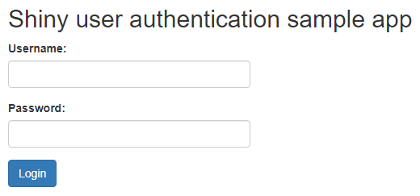

# user_authentication
A sample implementation of a login page for an R Shiny app. It uses the bcrypt R package which provides bindings to the 'blowfish' password hashing algorithm. We've used a similar method with database backend and also implemented a user and permission system on top of it. You can log into the demo app using admin / admin.

You can try out the app [here](https://shiny.epi-interactive.com/user_authentication)

